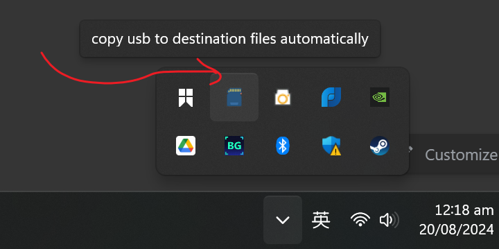
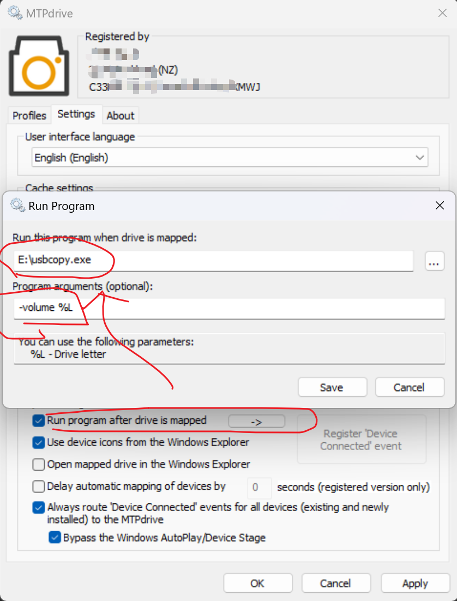

# usbcopy

A utility to watch USB/Removable drives and copy files to the destination folder automatically. 
The destination folder can be either synced to cloud or import into Lightroom catalog
With this tool, it can largely improve your photography post-processing workflow.

> Inspired by Synology USB Copy add-on package.

## How to use

### CLI

- simple

```
C:\> usbcopy.exe -volume Z
```

```
Usage of usbcopy.exe:
  -dst string
        absolute path to the destination folder (default "E:/Photos/raw/%year%-%month%-%day%/%name%_%counter%.%extension%")
  -filters string
        a comma seperated list of file extensions without prefixed dot (default "NEF,JPEG,JPG,MOV,MP4")
  -src string
        absolute path to the source folder (default "%volume%:/DCIM")
  -volume string
        volume letter (default "Z")
```

- watch

```
C:\> usbcopy.watch.exe
```

```
Usage of usbcopy.watch.exe:
  -dst string
        absolute path to the destination folder (default "E:/Photos/raw/%year%-%month%-%day%/%name%_%counter%.%extension%")
  -filters string
        a comma seperated list of file extensions without prefixed dot (default "NEF,JPEG,JPG,MOV,MP4")
  -interval int
        watch interval in seconds (default 3)
  -src string
        absolute path to the source folder (default "%volume%:/DCIM")
  -volume string
        volume name to watch, no need to be full name (default "Z 6_2")
```

### GUI

```
C:\> usbcopy.gui.exe
```



You should be able to see the icon in system tray of right corner.

In GUI mode, there is a `usbcopy.yml` beside for configurations and `usbcopy.log` for logging.

Notifications will be sent when something needs your attention.
- USB injected
- USB ejected
- file copying complete

### variables

When you specify `src-path`, `dst-path`, some variables can be used to dynamically build the path

- `src-path`
  - `%volume%`: volume letter which was detected by `usbcopy`

- `dst-path`
  - `%filename%`: file name with extension
  - `%name%`: file name only
  - `%extension%`: file extension
  - `%dir%`: file base folder relative to `source-path`
  - `%year%`: modification year
  - `%month%`: modification month
  - `%day%`: modification day

## SD Card / CF Express

You need a card reader to plug in PC and it is mounted as a USB massive storage, then use `usbcopy` to scan the disk and copy photos.

## MTP/PTP

If your camera only allows MTP/PTP device when connecting to PC using USB cable, you have to mount MTP device as a Massive Storage,
[MTPDrive](https://www.mtpdrive.com/) is a good companion to help you set it up automatically.

Once MTP device is mapped to a removable storage, then you can use `usbcopy` to scan the disk and copy photos.




## Roadmap

- [x] System tray
- [x] Windows desktop notification integration
- [x] better logging & configuration
- [x] flexible file renaming strategies and directory layout
- [ ] Windows service wrapper